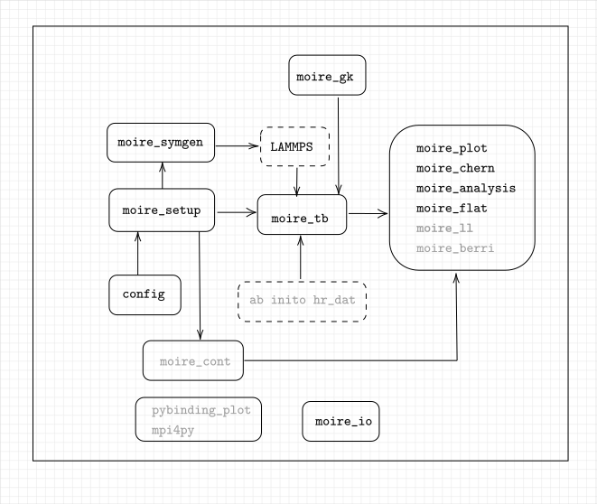

# Truncated Atomic Plane Wave Method
[](https://codecov.io/gh/zybbigpy/TBG)
[](https://github.com/zybbigpy/TBG/actions/workflows/ci.yml)
[](https://opensource.org/licenses/MIT)

## Features

- [x] Tight Binding Solver for TBG problem: `TBPLW`, `TBFULL`, `TBSPASE` methods implemented.
- [x] Continumm model solver.
- [x] Different TB method band structure comparison.
- [x] Moire potential Analysis.
- [x] Valley Chern number calculation.
- [x] $C_3$ symmetry constrain.

## Dependent Module
 
Our development is based on `SciPy`, `Numpy`, `Sklearn`, `Pybinding` and `matplotlib`.

## RoadMap



## Reference and Citation

1. For continuum model, refer to [this PRX paper by Koshino](https://journals.aps.org/prx/abstract/10.1103/PhysRevX.8.031087).
2. For TAPW please cite [this arxiv paper](https://arxiv.org/abs/2210.02026):

```bash
@misc{2210.02026,
Author = {Wangqian Miao and Chu Li and Ding Pan and Xi Dai},
Title = {Truncated Atomic Plane Wave Method for the Subband Structure Calculations of Moiré Systems},
Year = {2022},
Eprint = {arXiv:2210.02026},
}
```

