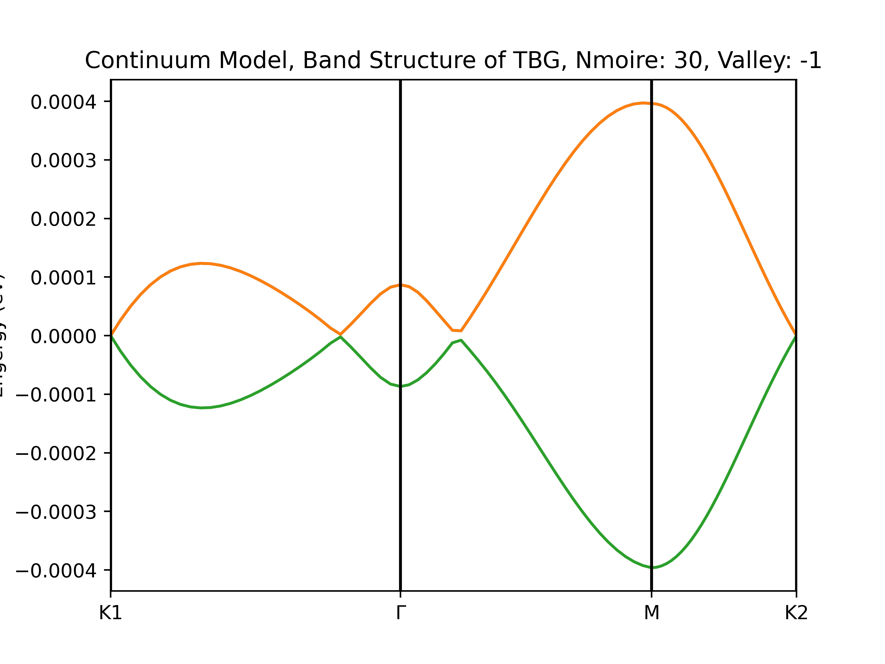

# Plane Wave Basis Sets for Twist Bilayer Graphene

## Graphene Coordinates

For TB model, see the notes in `/notes` folder. For continuum model, refer to [this PRX paper by Koshino](https://journals.aps.org/prx/abstract/10.1103/PhysRevX.8.031087)

## Code Structures

- [x] Tight Binding Model (CPU)

- [x] Tight Binding Model in Magnetic Field (Periodic Landau Gauge)

- [x] Continuum Model

## Dependent Module

See `requirements.txt`. You can refer to `.github/workflows/main.yml` I provide to set up the environment.

## Relationship between n_moire and angle

This is an output of wanniertools (full tb solution)

## Glist Construction

for tight binding (nsymm case, specific valley 1)

for magnetic tight binding (specific valley 1)

## Example Output

### Tight Binding

For `n_moire = 30, valley = 1`:

For `n_moire = 30, valley = -1`:

### Continuum

For `n_moire = 30, valley = 1`:

For `n_moire = 30, valley = -1`:

