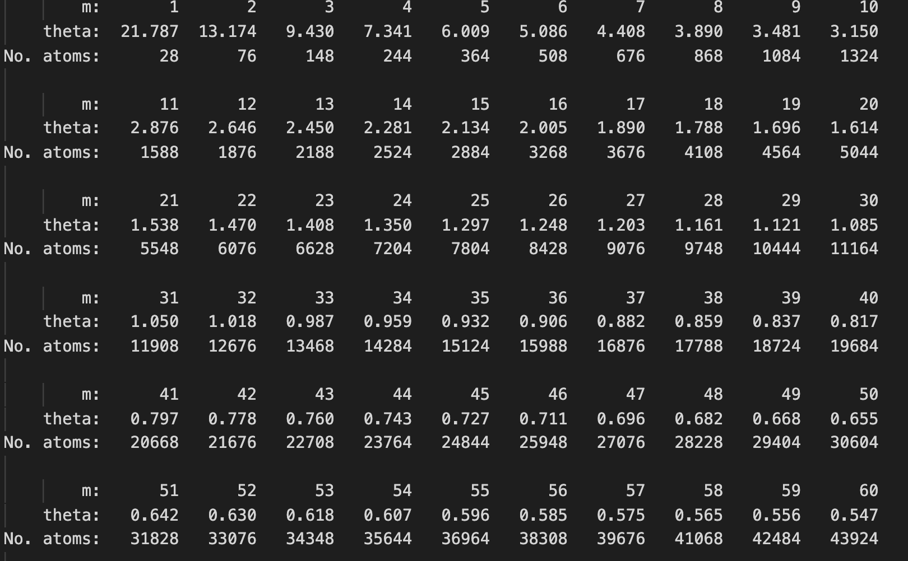
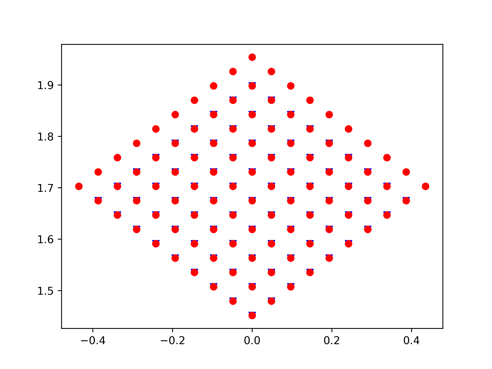
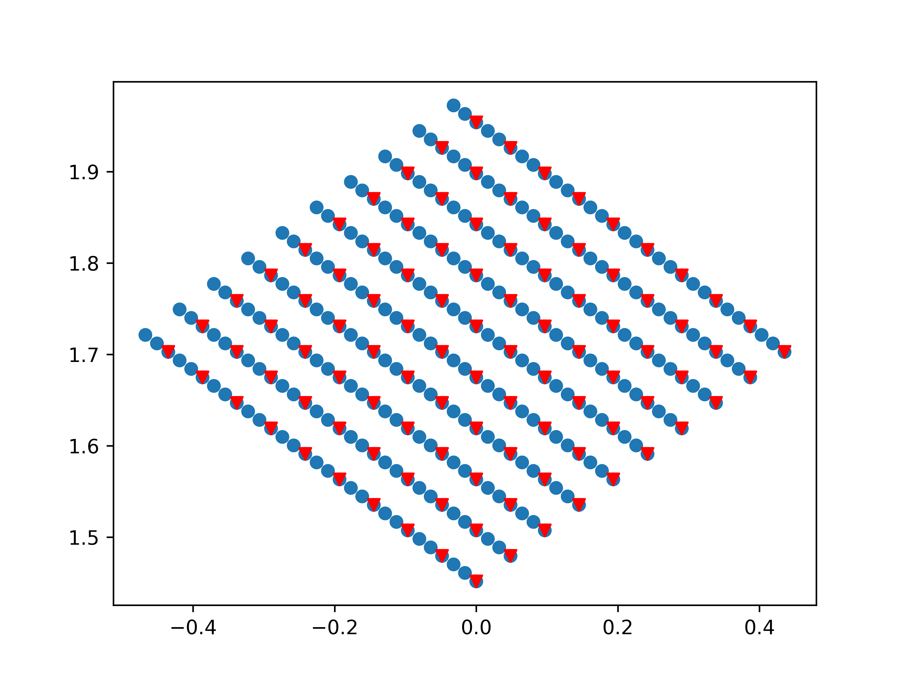
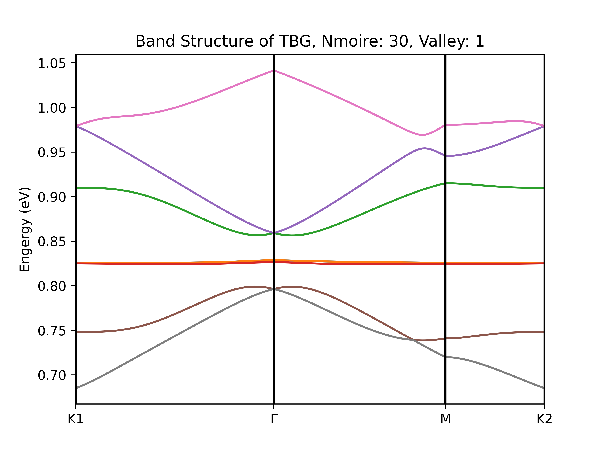
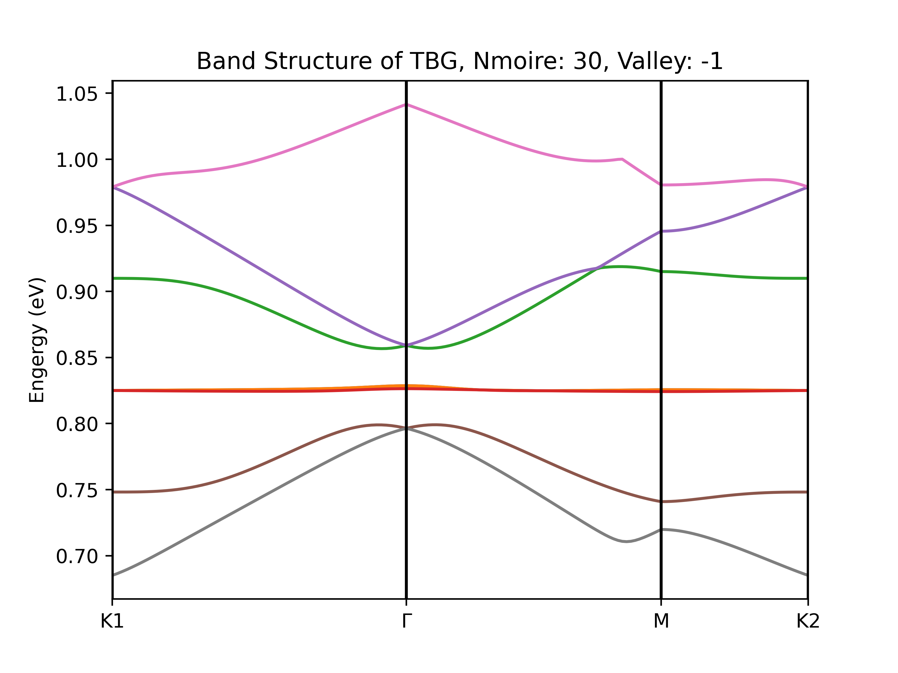

# Tight Binding Method for Twist Bilayer Graphene

## Graphene Coordinates

See the notes.

## Code Structures

- [x] Tight Binding Model (CPU)

- [x] Tight Binding Model in Magnetic Field

## Dependent Module

1. Numpy
2. Scipy

## Relationship between n_moire and angle

This is an output of wanniertools (full tb solution)

## Glist Construction

for tight binding (nsymm case, specific valley 1)

for magnetic tight binding (specific valley 1)

## Example Output

For `n_moire = 30, valley = 1`:

For `n_moire = 30, valley = -1`:

