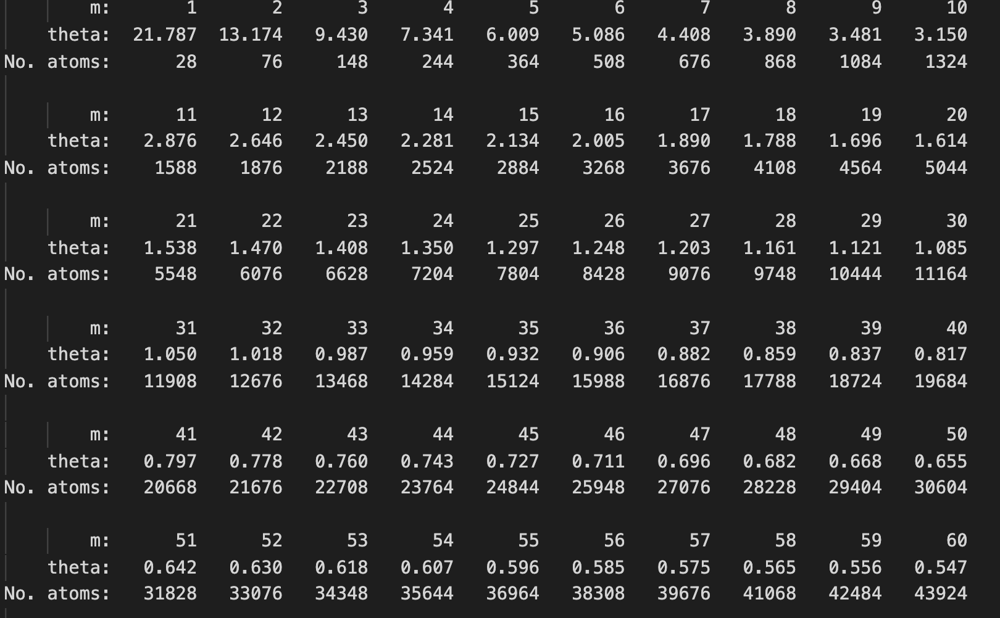
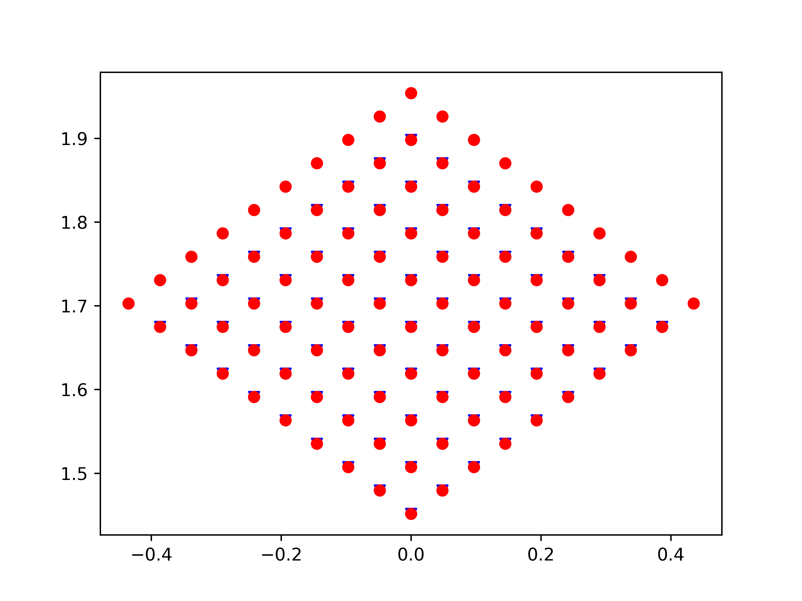
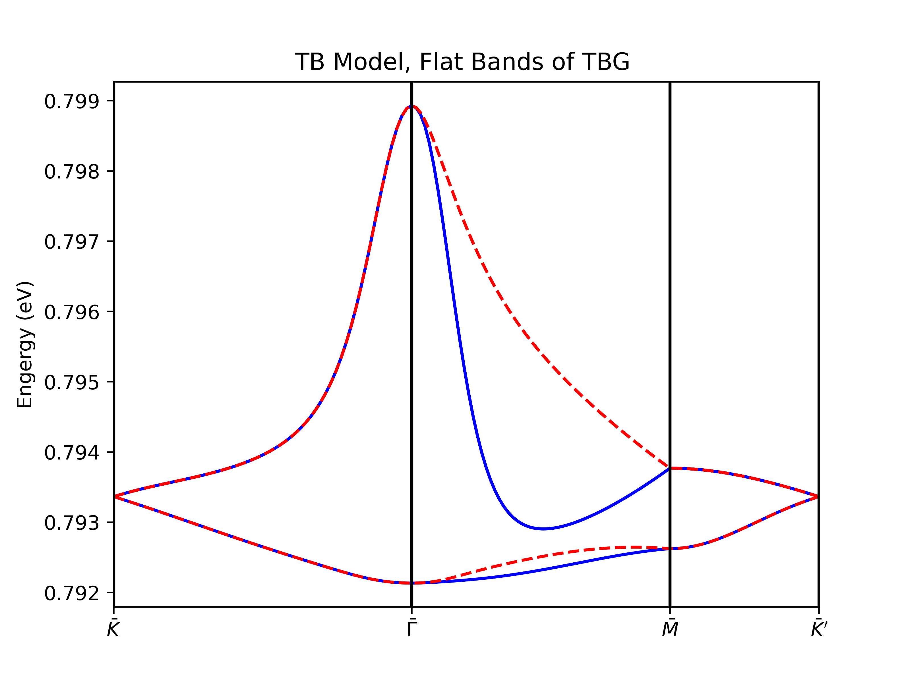
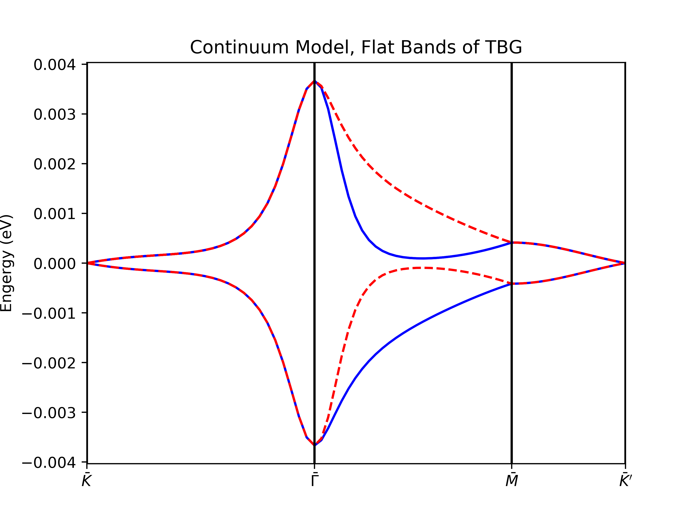
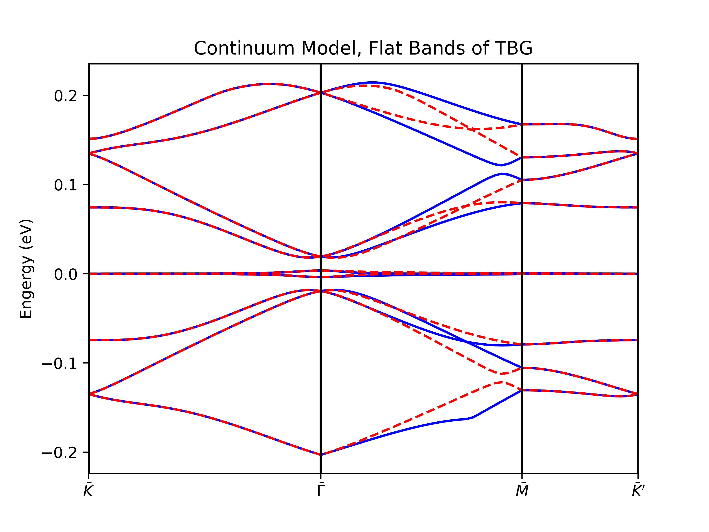

# Tight Binding Planewave Method for Twisted Bilayer Graphene

## Reference and Citation

1. For continuum model, refer to [this PRX paper by Koshino](https://journals.aps.org/prx/abstract/10.1103/PhysRevX.8.031087).
2. For TB Planewave method, please cite my MPhil Thesis.

## Code Structures

- [x] Tight Binding Model (CPU)
- [x] Tight Binding for Relaxed Strucutre 

- [x] Continuum Model

## Dependent Module

See `requirements.txt`. You can refer to `.github/workflows/main.yml` I provide to set up the environment.

## Relationship between n_moire and angle

This is an output of wanniertools (full tb solution)

## Glist Construction

for tight binding (nsymm case, specific valley 1)

## Example Output

### Tight Binding

For `n_moire = 30`, four bands

### Continuum

For `n_moire = 31`, four bands:

For `n_moire = 31`, more bands:

