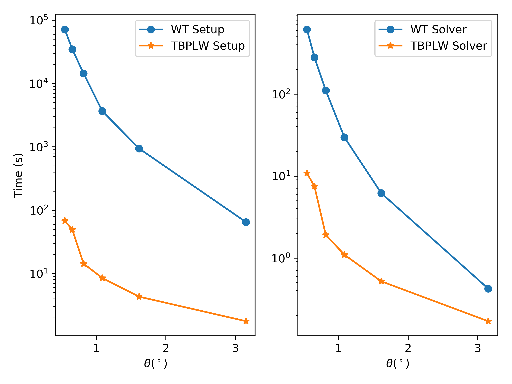

Benchmark
=========

We benchmarked our `TBPLW` method with the full tight binding scheme implemented in `WannierTools`. The left panel shows the time cost to setup the tight binding kernel or hopping file `hr_dat`,
The right panel presents the time cost to solve the Hamiltonian per k point.

