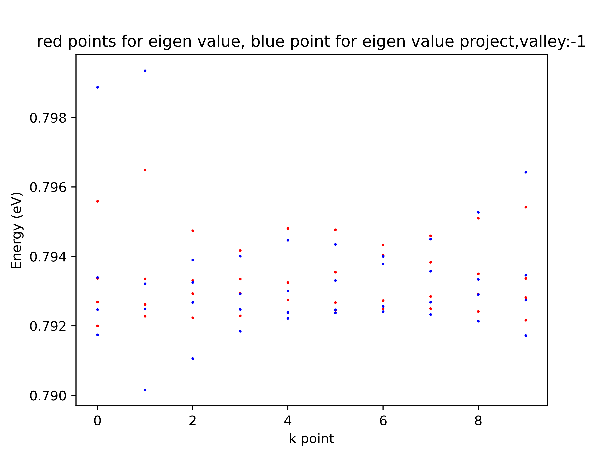
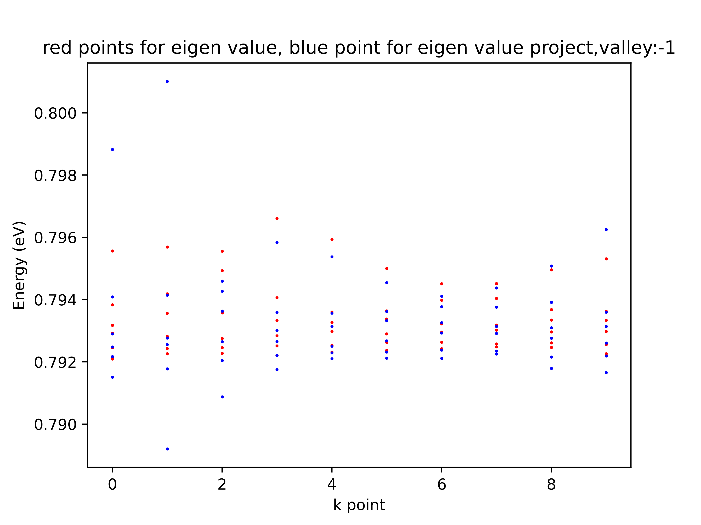
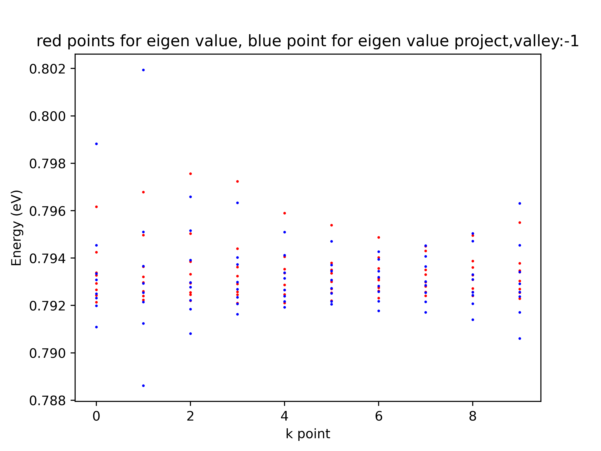
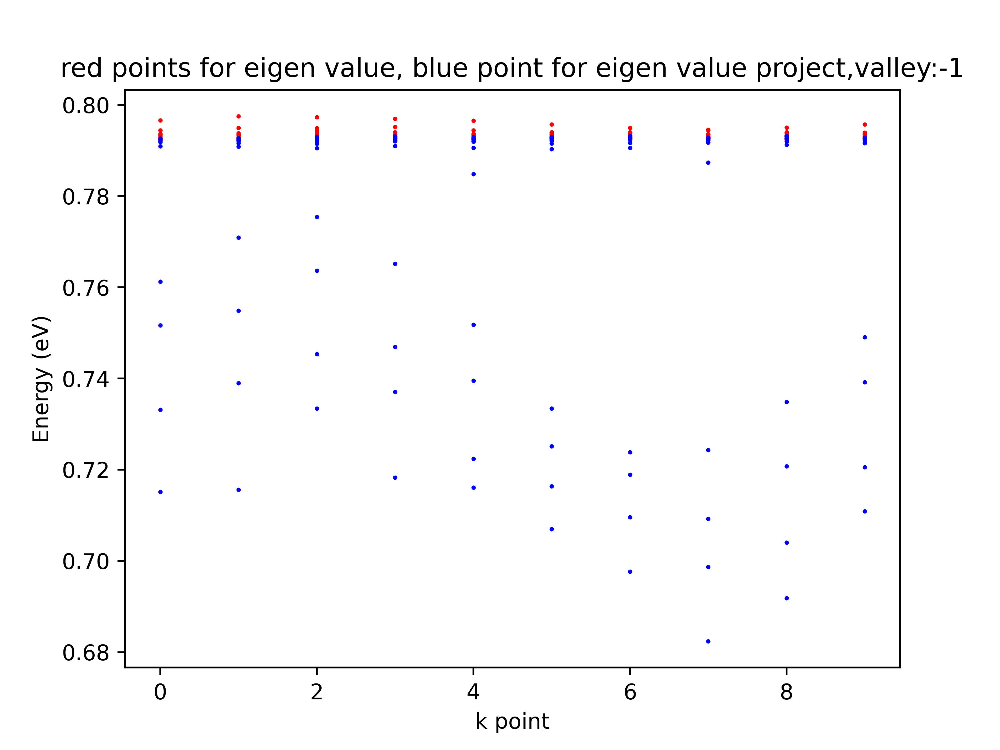
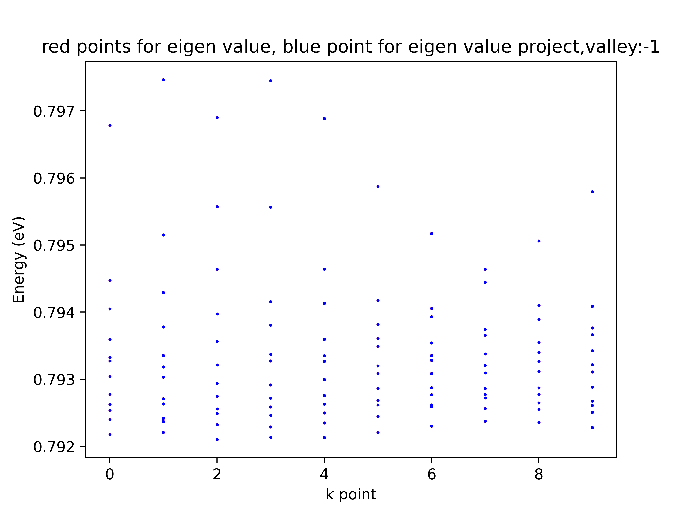
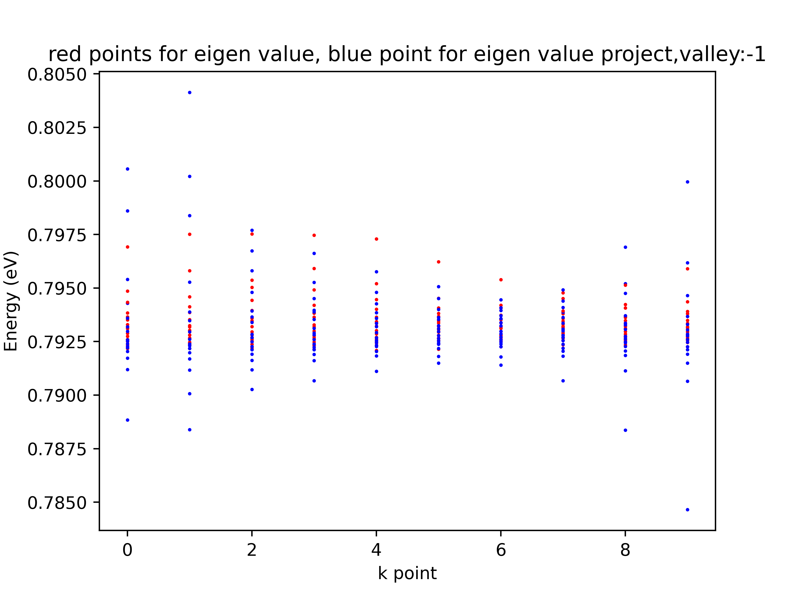
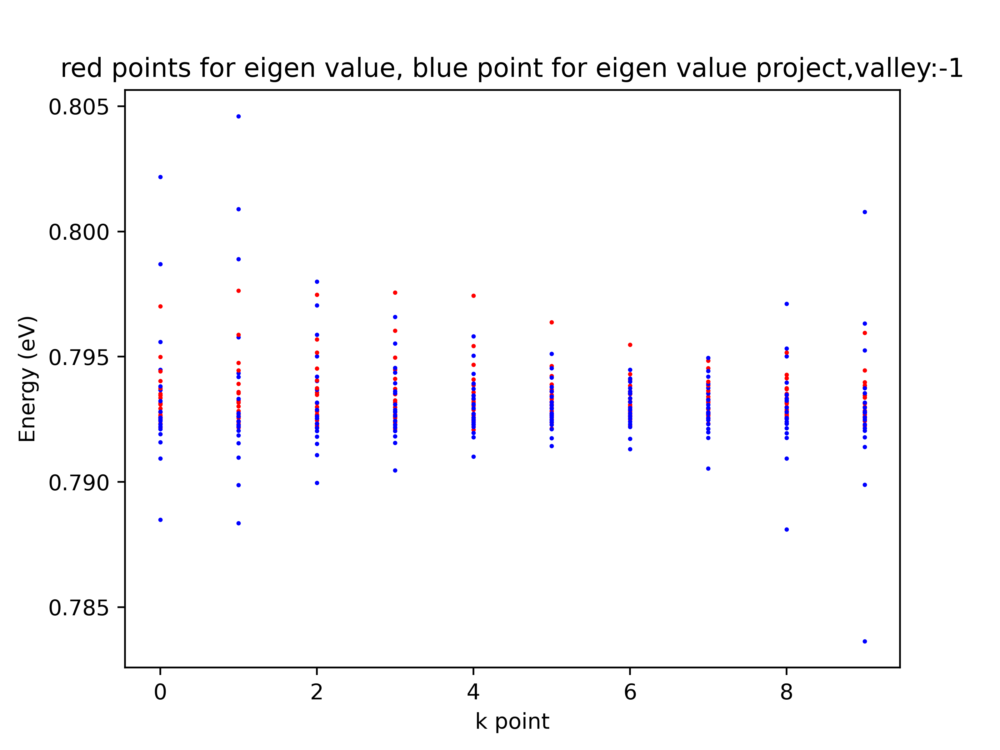
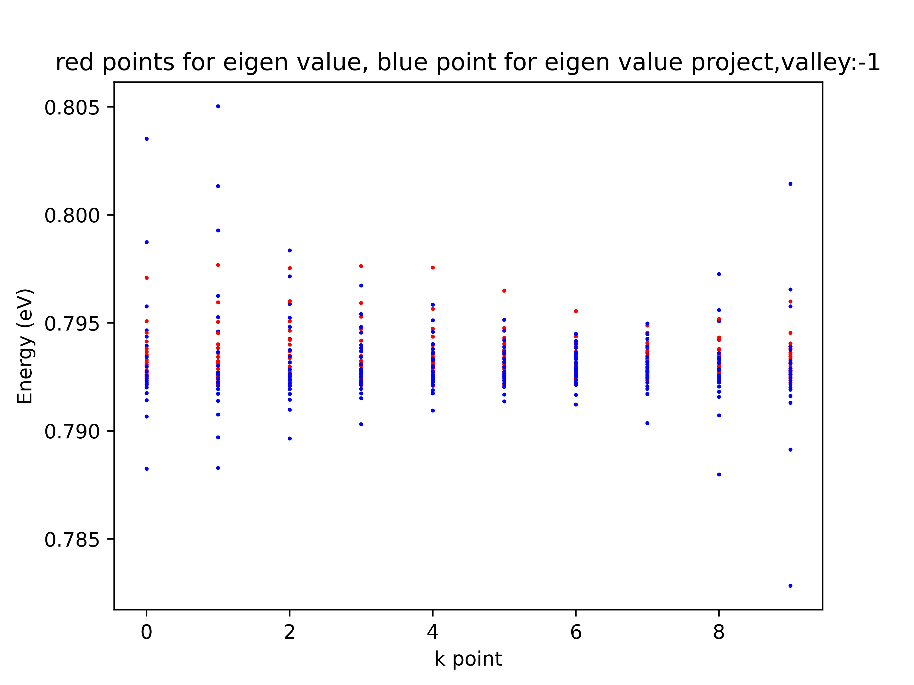

## Magnetic Field

| `(p, q)` | Magnetic Field (T) |
| -------- | ------------------ |
| `(1, 2)` | 14.14|
| `(1, 3)` | 9.42 |
| `(1, 4)` | 7.06 |
| `(1, 5)` | 5.64 |
| `(1, 6)` | 4.71 |
| `(1, 7)` | 4.04 |
| `(1, 8)` | 3.53 |
| `(1, 9)` | 3.14 |
| `(1, 10)`| 2.83 |

## Eigen Value Project, Valley -1, p = 1

### `q = 2`


```
dmesh loaded shape: (10, 800, 800)
---------------------------------------
eigen val hamk: [0.7919965  0.79269074 0.7933656  0.79558795]
eigen val ham proj: [0.79174357 0.79246983 0.79339574 0.7988682 ]
---------------------------------------
eigen val hamk: [0.79227932 0.79261662 0.79335797 0.79649237]
eigen val ham proj: [0.790155   0.79249098 0.79321297 0.79934684]
---------------------------------------
eigen val hamk: [0.79223438 0.79293003 0.79330672 0.79473882]
eigen val ham proj: [0.79105529 0.79267854 0.79325186 0.79389493]
---------------------------------------
eigen val hamk: [0.79228877 0.79293304 0.79334878 0.79417327]
eigen val ham proj: [0.79184427 0.79247314 0.79292288 0.79400689]
---------------------------------------
eigen val hamk: [0.7923718  0.79274688 0.79324687 0.79480601]
eigen val ham proj: [0.79221574 0.79238911 0.79300353 0.79446905]
---------------------------------------
eigen val hamk: [0.79244677 0.79267254 0.79354504 0.79476871]
eigen val ham proj: [0.79237891 0.79246169 0.79330786 0.79434633]
---------------------------------------
eigen val hamk: [0.79249008 0.79272733 0.79402622 0.79432786]
eigen val ham proj: [0.79240733 0.79256137 0.79378342 0.7939992 ]
---------------------------------------
eigen val hamk: [0.79249853 0.79284502 0.79383365 0.79459103]
eigen val ham proj: [0.79232637 0.79268273 0.79357602 0.79450077]
---------------------------------------
eigen val hamk: [0.79241673 0.79291073 0.79349635 0.7950988 ]
eigen val ham proj: [0.79213531 0.79290085 0.793341   0.79526874]
---------------------------------------
eigen val hamk: [0.79216461 0.7928144  0.79336763 0.79541986]
eigen val ham proj: [0.79171756 0.79274557 0.79346113 0.79642395]
```

### `q = 3`



```
n_moire: 30 , equals anlgle (degree) 1.0845490491577974
n_moire: 30 , equals anlgle (degree) 1.0845490491577974
dmesh loaded shape: (10, 1200, 1200)
-------------------------------------------------------
eigen val hamk: [0.79208923 0.7924579  0.7929184  0.79317674 0.79383635 0.79556279]
eigen val ham proj: [0.79150515 0.7921697  0.79247658 0.79290131 0.79409036 0.79882696]
-------------------------------------------------------
eigen val hamk: [0.79225726 0.79242603 0.79282186 0.79356267 0.79418312 0.79569043]
eigen val ham proj: [0.78920323 0.79177562 0.79255343 0.79276848 0.79414332 0.80101113]
-------------------------------------------------------
eigen val hamk: [0.79227337 0.79245594 0.79275109 0.79357411 0.79492815 0.79555877]
eigen val ham proj: [0.79087817 0.79204117 0.79264884 0.79363467 0.79427359 0.79459087]
-------------------------------------------------------
eigen val hamk: [0.79221402 0.79251019 0.79283467 0.79332785 0.79406184 0.79660976]
eigen val ham proj: [0.79174631 0.79220676 0.79264843 0.79300896 0.79359843 0.7958351 ]
-------------------------------------------------------
eigen val hamk: [0.79231435 0.79253152 0.79298225 0.79327347 0.79360619 0.79593654]
eigen val ham proj: [0.79209577 0.79228649 0.79250994 0.79314277 0.79356646 0.79537157]
-------------------------------------------------------
eigen val hamk: [0.79237248 0.79262852 0.79290218 0.7933777  0.79363764 0.79500421]
eigen val ham proj: [0.79212045 0.79231879 0.79267521 0.79332061 0.79361903 0.7945459 ]
-------------------------------------------------------
eigen val hamk: [0.79242157 0.79263213 0.7929567  0.79322404 0.79398456 0.79450739]
eigen val ham proj: [0.79211009 0.79238205 0.79293062 0.79325543 0.79376994 0.79410707]
-------------------------------------------------------
eigen val hamk: [0.79248399 0.7925782  0.79302255 0.79317871 0.79404192 0.79451892]
eigen val ham proj: [0.79225468 0.79234771 0.79291717 0.79314039 0.79375659 0.79437947]
-------------------------------------------------------
eigen val hamk: [0.7924613  0.79261513 0.79296516 0.79333987 0.79368307 0.79495936]
eigen val ham proj: [0.7917882  0.79215568 0.79276224 0.79309459 0.79391251 0.79507975]
-------------------------------------------------------
eigen val hamk: [0.79226134 0.79255684 0.79298006 0.79333635 0.79362482 0.79531088]
eigen val ham proj: [0.79165886 0.79219148 0.79260793 0.79313668 0.79359316 0.79625274]

```

### `q = 4`


```
n_moire: 30 , equals anlgle (degree) 1.0845490491577974
n_moire: 30 , equals anlgle (degree) 1.0845490491577974
dmesh loaded shape: (10, 1600, 1600)
---------------------------------------------------------
eigen val hamk: [0.79213627 0.79242322 0.792664   0.79293538 0.79327558 0.79338693
 0.79424677 0.79617012]
eigen val ham proj: [0.7910921  0.79198959 0.79231536 0.79249881 0.7930822  0.79334653
 0.79454485 0.79882147]
---------------------------------------------------------
eigen val hamk: [0.79223398 0.79239945 0.79259627 0.79296752 0.79320535 0.79363609
 0.79496972 0.79678419]
eigen val ham proj: [0.78861787 0.79124179 0.79214532 0.79254607 0.79293271 0.79366374
 0.79510809 0.80193946]
---------------------------------------------------------
eigen val hamk: [0.79220454 0.7924574  0.79255405 0.79294234 0.79332266 0.7938484
 0.79503523 0.79756083]
eigen val ham proj: [0.79081748 0.79184397 0.79222144 0.79277383 0.79296964 0.79391841
 0.79515772 0.79658994]
---------------------------------------------------------
eigen val hamk: [0.79209581 0.79245528 0.7925741  0.79291168 0.79323965 0.79362423
 0.79439752 0.79723839]
eigen val ham proj: [0.79162764 0.79206621 0.79234758 0.79268641 0.79298479 0.79373614
 0.79402675 0.79633168]
---------------------------------------------------------
eigen val hamk: [0.79210763 0.79246148 0.79265471 0.79286788 0.79336734 0.79353074
 0.79405487 0.7958995 ]
eigen val ham proj: [0.7919266  0.79217094 0.79239613 0.79265185 0.79314566 0.79338731
 0.79411741 0.79509896]
---------------------------------------------------------
eigen val hamk: [0.79220303 0.79253243 0.79270163 0.7930011  0.79336224 0.79350067
 0.79379305 0.79538965]
eigen val ham proj: [0.79204868 0.79216757 0.79251245 0.79272426 0.79307364 0.7934577
 0.79370981 0.79470715]
---------------------------------------------------------
eigen val hamk: [0.79231568 0.79261499 0.79274721 0.79307431 0.79315711 0.79356194
 0.79402367 0.79487675]
eigen val ham proj: [0.79177169 0.79217662 0.79258332 0.79282231 0.79319042 0.79345088
 0.7939452  0.79427499]
---------------------------------------------------------
eigen val hamk: [0.79240471 0.79256397 0.79280687 0.79299002 0.7933006  0.79350383
 0.79430298 0.79449946]
eigen val ham proj: [0.79171167 0.79215093 0.79254464 0.79285205 0.79301431 0.79364413
 0.79407337 0.79452314]
---------------------------------------------------------
eigen val hamk: [0.79241085 0.79256701 0.79271507 0.79309268 0.7932804  0.79360393
 0.79387618 0.79495455]
eigen val ham proj: [0.79139803 0.79207239 0.79243537 0.79255558 0.79309728 0.79330319
 0.79471621 0.79504052]
---------------------------------------------------------
eigen val hamk: [0.79228779 0.79254366 0.79269579 0.79303758 0.79340913 0.79347439
 0.79377741 0.79549908]
eigen val ham proj: [0.7906106  0.79170996 0.79237485 0.79256625 0.79291206 0.79341634
 0.79454258 0.79630701]

```

### `q = 5`


```
n_moire: 30 , equals anlgle (degree) 1.0845490491577974
n_moire: 30 , equals anlgle (degree) 1.0845490491577974
dmesh loaded shape: (10, 2000, 2000)
-------------------------------------------------------
eigen val hamk: [0.79215945 0.79241418 0.79257558 0.79272046 0.79296751 0.79323563
 0.79351095 0.79365413 0.79438419 0.79662054]
eigen val ham proj: [0.79052348 0.79181535 0.79217625 0.79234258 0.79249857 0.79273734
 0.7935359  0.794483   0.79488304 0.79883948]
-------------------------------------------------------
eigen val hamk: [0.79222142 0.79238442 0.79248389 0.7927185  0.7929168  0.79331109
 0.79354735 0.79377594 0.7949964  0.79749947]
eigen val ham proj: [0.78837888 0.79083941 0.7918114  0.79226078 0.79249844 0.7926157
 0.79365478 0.79533586 0.79607128 0.80260036]
-------------------------------------------------------
eigen val hamk: [0.79212602 0.79238625 0.79250197 0.79270977 0.79285392 0.79333901
 0.7938885  0.79428334 0.79488891 0.79727058]
eigen val ham proj: [0.7907429  0.79169364 0.79203976 0.79234138 0.79268537 0.79314483
 0.79352316 0.7940582  0.79571667 0.79794106]
-------------------------------------------------------
eigen val hamk: [0.79207642 0.79235031 0.79256575 0.79261279 0.7929895  0.79318907
 0.79343421 0.79398845 0.79518727 0.79697012]
eigen val ham proj: [0.7914734  0.79191338 0.79222631 0.79238557 0.79276228 0.79302862
 0.79334526 0.79411273 0.79463468 0.79588509]
-------------------------------------------------------
eigen val hamk: [0.79207657 0.79239533 0.79256861 0.79271852 0.79291399 0.79326545
 0.79352215 0.79367601 0.79440986 0.79656946]
eigen val ham proj: [0.79169782 0.79205298 0.79233823 0.79241687 0.79276093 0.79297576
 0.79327029 0.79367341 0.79412878 0.79550427]
-------------------------------------------------------
eigen val hamk: [0.79218715 0.79250151 0.79261726 0.79278366 0.79308061 0.79324406
 0.79350064 0.79375605 0.79397691 0.79569871]
eigen val ham proj: [0.79185247 0.79207607 0.79241598 0.79255423 0.79275836 0.79292882
 0.79332377 0.79353285 0.7940596  0.79490548]
-------------------------------------------------------
eigen val hamk: [0.79230597 0.79257065 0.79271644 0.79283178 0.79309977 0.79325816
 0.79336536 0.79380874 0.79402806 0.79499633]
eigen val ham proj: [0.79171274 0.79201823 0.7925273  0.79256196 0.79277336 0.79313112
 0.79340053 0.79374611 0.79395614 0.79431025]
-------------------------------------------------------
eigen val hamk: [0.79239015 0.79258142 0.7927526  0.79281853 0.79311323 0.79315033
 0.79356453 0.79358237 0.79438516 0.794567  ]
eigen val ham proj: [0.79107339 0.7920297  0.79236818 0.79257348 0.79286612 0.7930388
 0.79339727 0.79377827 0.79426665 0.79465331]
-------------------------------------------------------
eigen val hamk: [0.79237097 0.79254538 0.79270294 0.79283084 0.79311745 0.79330468
 0.79334361 0.7937895  0.79401768 0.79500993]
eigen val ham proj: [0.79086386 0.79185987 0.79220305 0.79237277 0.79253251 0.79301916
 0.79322039 0.79358542 0.79502001 0.79558862]
-------------------------------------------------------
eigen val hamk: [0.79228748 0.79254821 0.79261003 0.79279505 0.79308089 0.79323806
 0.79350864 0.79369833 0.79393419 0.79568508]
eigen val ham proj: [0.78887943 0.79162848 0.79215692 0.79243429 0.79261248 0.79283821
 0.79317958 0.79349423 0.79549597 0.79674526]

```

### `q = 6`


```
n_moire: 30 , equals anlgle (degree) 1.0845490491577974
n_moire: 30 , equals anlgle (degree) 1.0845490491577974
dmesh loaded shape: (10, 2400, 2400)
--------------------------------------------------------
eigen val hamk: [0.79217143 0.79239464 0.79253957 0.79262475 0.79277988 0.79303806
 0.79327326 0.79332547 0.79359349 0.79405066 0.79447825 0.79678716]
eigen val ham proj: [0.78989664 0.79162893 0.79203642 0.79224573 0.79235879 0.79251121
 0.79264864 0.79304588 0.79385636 0.79501053 0.79629255 0.79889917]
--------------------------------------------------------
eigen val hamk: [0.7922088  0.79237186 0.79241841 0.79263246 0.79270869 0.79303019
 0.79318533 0.79335249 0.79377962 0.79429212 0.79514856 0.79746337]
eigen val ham proj: [0.78836073 0.79053865 0.79153931 0.7920422  0.79231213 0.79241831
 0.79259843 0.79304835 0.7942269  0.79692924 0.79740395 0.80314941]
--------------------------------------------------------
eigen val hamk: [0.79210265 0.79232375 0.79248886 0.79255887 0.79274767 0.79293798
 0.79321383 0.79356323 0.7939734  0.79463797 0.79557184 0.79689837]
eigen val ham proj: [0.79064654 0.79152277 0.79190358 0.79214962 0.79240016 0.79276154
 0.79285037 0.79373044 0.7941634  0.7942565  0.79609728 0.79811918]
--------------------------------------------------------
eigen val hamk: [0.79213415 0.79228984 0.79246481 0.79258678 0.79271727 0.79291732
 0.79327248 0.79337383 0.79380556 0.79415491 0.79556473 0.79744783]
eigen val ham proj: [0.79124136 0.79177248 0.79212529 0.79224016 0.79250033 0.79277181
 0.79299892 0.79332921 0.79375719 0.79417626 0.79463848 0.79622249]
--------------------------------------------------------
eigen val hamk: [0.79213275 0.79234746 0.79249712 0.7926294  0.79275645 0.79299463
 0.79326751 0.79335185 0.79359493 0.79413086 0.79464053 0.79688437]
eigen val ham proj: [0.79144676 0.79195753 0.7922422  0.79234167 0.79253677 0.79273117
 0.79283297 0.79324684 0.79351281 0.7938015  0.79458365 0.79564275]
--------------------------------------------------------
eigen val hamk: [0.79220565 0.79244659 0.79261553 0.79268233 0.79286127 0.79308159
 0.79319906 0.79349246 0.79360627 0.79381739 0.79417761 0.7958684 ]
eigen val ham proj: [0.79168673 0.79196141 0.79233987 0.79248576 0.79258294 0.7927198
 0.79298213 0.7931946  0.79351555 0.79374428 0.79425454 0.79492113]
--------------------------------------------------------
eigen val hamk: [0.79229932 0.79259266 0.79261584 0.79277079 0.79287464 0.79308679
 0.79328338 0.79335359 0.79354325 0.79393229 0.79405555 0.79517174]
eigen val ham proj: [0.79166988 0.79192525 0.79237988 0.79248468 0.79262955 0.79285679
 0.79305375 0.79339468 0.79352562 0.7937816  0.79399302 0.79437879]
--------------------------------------------------------
eigen val hamk: [0.79237812 0.79256263 0.79272201 0.79277287 0.79286054 0.79309535
 0.79320588 0.79337879 0.79365731 0.79374337 0.79444484 0.79463941]
eigen val ham proj: [0.79079865 0.79194361 0.79231266 0.79244626 0.79259405 0.79281647
 0.79302498 0.7932605  0.79362136 0.79388034 0.79434079 0.79475744]
--------------------------------------------------------
eigen val hamk: [0.79235544 0.79255538 0.79264709 0.79277356 0.79287176 0.79311594
 0.79327124 0.79340014 0.79354395 0.79388874 0.79409874 0.79506212]
eigen val ham proj: [0.78978122 0.79161945 0.79199217 0.79234842 0.79241219 0.7926304
 0.79292798 0.79322107 0.79333723 0.79395234 0.79512031 0.79618686]
--------------------------------------------------------
eigen val hamk: [0.79227975 0.79250765 0.79260946 0.79267411 0.79288054 0.7931115
 0.79321753 0.79342674 0.79366373 0.79376647 0.79408636 0.79579503]
eigen val ham proj: [0.78727945 0.79153029 0.79193857 0.7922875  0.79235046 0.79264736
 0.79274813 0.79298088 0.79347935 0.79361888 0.79588731 0.79779313]
```

### `q = 7`

```
n_moire: 30 , equals anlgle (degree) 1.0845490491577974
n_moire: 30 , equals anlgle (degree) 1.0845490491577974
dmesh loaded shape: (10, 2800, 2800)
-------------------------------------------------------
eigen val hamk: [0.79217722 0.79236764 0.79252526 0.79258729 0.79266813 0.79285807
 0.79305061 0.79320941 0.79344466 0.7934665  0.79367396 0.79426839
 0.79466083 0.79685347]
eigen val ham proj: [0.78931438 0.79142184 0.79188206 0.79215409 0.792288   0.79236978
 0.7925321  0.7926483  0.79288728 0.79334428 0.79409659 0.79521487
 0.79800423 0.79920002]
-------------------------------------------------------
eigen val hamk: [0.79219271 0.79234964 0.79240045 0.79253364 0.79265883 0.79278078
 0.7929888  0.79322024 0.79331303 0.79363516 0.79388284 0.79452226
 0.79556488 0.79740204]
eigen val ham proj: [0.78839284 0.79029022 0.79134673 0.79184372 0.79213159 0.79234364
 0.79240415 0.79262079 0.79293947 0.7934686  0.79476249 0.7977277
 0.79908689 0.80365128]
-------------------------------------------------------
eigen val hamk: [0.79212991 0.7922693  0.79243102 0.79252524 0.79264421 0.79277576
 0.79294123 0.79320619 0.79357428 0.79373563 0.79412358 0.7946868
 0.7956441  0.79732728]
eigen val ham proj: [0.79049556 0.79134415 0.79175531 0.79202914 0.79222633 0.79246446
 0.79266586 0.79293361 0.79330407 0.79387397 0.79451588 0.7952045
 0.79636302 0.7978258 ]
-------------------------------------------------------
eigen val hamk: [0.792172   0.7922857  0.79238484 0.79256554 0.79260934 0.79275078
 0.7929735  0.7931734  0.7933737  0.7936018  0.79411259 0.79462919
 0.79553581 0.79760615]
eigen val ham proj: [0.79094565 0.79167614 0.79200218 0.79218681 0.79232432 0.79255622
 0.79280632 0.79296772 0.79315748 0.79363963 0.79390297 0.79447449
 0.79469028 0.79660258]
-------------------------------------------------------
eigen val hamk: [0.7921188  0.79233967 0.79245411 0.79255928 0.79267871 0.79279542
 0.79302212 0.79326992 0.79331924 0.79353706 0.7938037  0.79420263
 0.79504512 0.79703996]
eigen val ham proj: [0.79124753 0.79188588 0.79213296 0.79231462 0.79240471 0.79257211
 0.79264403 0.79287961 0.79324373 0.79340382 0.79368299 0.79409553
 0.7948071  0.79563217]
-------------------------------------------------------
eigen val hamk: [0.79217147 0.79242168 0.79257865 0.79264229 0.79275277 0.79291606
 0.79304628 0.79321072 0.7934197  0.79354115 0.79369314 0.79397954
 0.79434348 0.79608626]
eigen val ham proj: [0.79157717 0.79187194 0.79225716 0.79243668 0.79249269 0.79260348
 0.79276005 0.79300966 0.79311329 0.79342745 0.79360799 0.79383254
 0.79433082 0.79502876]
-------------------------------------------------------
eigen val hamk: [0.79227387 0.79254364 0.79264236 0.79270009 0.7927773  0.79293103
 0.79311663 0.79322258 0.79338767 0.79352819 0.79363828 0.79405389
 0.79409314 0.7952799 ]
eigen val ham proj: [0.79154348 0.79185037 0.79231856 0.79243934 0.7925502  0.79267019
 0.79286502 0.79301867 0.79327462 0.79348771 0.79357743 0.79391217
 0.79405021 0.79441604]
-------------------------------------------------------
eigen val hamk: [0.79236057 0.79255294 0.79268523 0.79271512 0.79285899 0.79288564
 0.7931435  0.79318657 0.79339272 0.79346259 0.79374315 0.79382854
 0.79448508 0.79471447]
eigen val ham proj: [0.79072689 0.79187659 0.79217432 0.79233825 0.79246507 0.79266383
 0.79280536 0.79301173 0.79314097 0.79348573 0.79379307 0.79396748
 0.79436634 0.79484817]
-------------------------------------------------------
eigen val hamk: [0.79235007 0.7925581  0.79260786 0.79271995 0.79281866 0.7929268
 0.79313686 0.79324513 0.79333118 0.79357919 0.79360458 0.79398248
 0.79417465 0.7951019 ]
eigen val ham proj: [0.78888982 0.79134217 0.79191438 0.79221327 0.79242624 0.79245863
 0.79267145 0.79279492 0.79318485 0.79326373 0.79350897 0.79436543
 0.79516988 0.79661586]
-------------------------------------------------------
eigen val hamk: [0.79226829 0.79247706 0.79257415 0.79266882 0.7927725  0.79292728
 0.79310066 0.79322955 0.7933597  0.79357904 0.79374106 0.79384511
 0.79423462 0.79585802]
eigen val ham proj: [0.7858738  0.79127949 0.79164853 0.79206402 0.79223099 0.79237832
 0.79264618 0.79274552 0.79291357 0.79313857 0.79360608 0.7940637
 0.79605574 0.79894695]
```

### `q = 8`


```
n_moire: 30 , equals anlgle (degree) 1.0845490491577974
n_moire: 30 , equals anlgle (degree) 1.0845490491577974
dmesh loaded shape: (10, 3200, 3200)
-------------------------------------------------------
eigen val hamk: [0.79217907 0.79234577 0.79250164 0.79258406 0.79259978 0.79274273
 0.79289071 0.79310192 0.79319399 0.79329487 0.79351061 0.7936555
 0.79383332 0.79434177 0.79485972 0.79692571]
eigen val ham proj: [0.78884113 0.79118849 0.79173109 0.79204536 0.79220907 0.79226899
 0.7923999  0.79253034 0.79258653 0.79298241 0.79319144 0.79359644
 0.79429555 0.79540585 0.79860302 0.80056498]
-------------------------------------------------------
eigen val hamk: [0.79217816 0.79232883 0.79239446 0.79247114 0.79262672 0.7926646
 0.79280782 0.79302743 0.7931906  0.7932415  0.79352503 0.79386639
 0.79412929 0.79458587 0.79580977 0.79750865]
eigen val ham proj: [0.78839075 0.79007    0.79117239 0.79169054 0.79198399 0.79218092
 0.79231107 0.79238933 0.79260996 0.79295362 0.79347564 0.79387945
 0.79527973 0.79838058 0.80021797 0.80413399]
-------------------------------------------------------
eigen val hamk: [0.7921653  0.7922366  0.79237395 0.79250149 0.79258234 0.79267172
 0.79280906 0.7929583  0.79320422 0.79346233 0.79359269 0.79395562
 0.79442962 0.79502639 0.79536529 0.79752681]
eigen val ham proj: [0.79026199 0.79118529 0.79162754 0.79191253 0.79212152 0.79227527
 0.7924953  0.79269092 0.79284361 0.79339828 0.79365769 0.79392949
 0.79480049 0.79580634 0.79674054 0.79769432]
-------------------------------------------------------
eigen val hamk: [0.79214281 0.79232356 0.79234208 0.79247667 0.79259699 0.79267398
 0.79276605 0.79299408 0.79318271 0.79328143 0.79364392 0.79383104
 0.79419613 0.79491507 0.79591331 0.79746123]
eigen val ham proj: [0.79067122 0.79161048 0.79190065 0.7921226  0.79223342 0.79239398
 0.79260114 0.79281482 0.79290182 0.79311895 0.79353996 0.79388311
 0.79396256 0.79450635 0.79526663 0.79661729]
-------------------------------------------------------
eigen val hamk: [0.79208612 0.79232618 0.79243259 0.79252012 0.79260895 0.79269661
 0.79286018 0.79301899 0.79322123 0.79337077 0.79342842 0.79364181
 0.79400856 0.79446408 0.7952036  0.79729736]
eigen val ham proj: [0.79111167 0.7918291  0.79204095 0.79227279 0.79232716 0.79246095
 0.79254558 0.79268155 0.79291796 0.79320135 0.79334889 0.79358624
 0.79384846 0.79426827 0.79480076 0.7957627 ]
-------------------------------------------------------
eigen val hamk: [0.79214012 0.79239574 0.79254799 0.79264024 0.79267165 0.79279285
 0.79294873 0.79306091 0.79321582 0.79337342 0.79347073 0.79367206
 0.79381018 0.79407345 0.7945189  0.79622607]
eigen val ham proj: [0.79149889 0.79180463 0.79217997 0.79237101 0.79243421 0.79253074
 0.79264878 0.79278044 0.79296327 0.79310512 0.79325013 0.79353639
 0.79363209 0.79400347 0.79450532 0.79506258]
-------------------------------------------------------
eigen val hamk: [0.79225673 0.79252326 0.79260846 0.79267363 0.79277338 0.79281875
 0.79297504 0.79311728 0.79319281 0.79337676 0.79352502 0.79356512
 0.79372919 0.79406943 0.79420162 0.79538737]
eigen val ham proj: [0.79140837 0.79178244 0.79226227 0.79239137 0.79248034 0.79259066
 0.79271614 0.79286273 0.79297755 0.79323015 0.79338914 0.79357513
 0.79371135 0.79395725 0.79407994 0.79444937]
-------------------------------------------------------
eigen val hamk: [0.79234786 0.79254924 0.79265317 0.79269626 0.7927959  0.79285811
 0.79292377 0.79315109 0.79321293 0.79332096 0.79345575 0.7935785
 0.79380684 0.79392553 0.79451404 0.79477883]
eigen val ham proj: [0.79067299 0.79181629 0.79205658 0.79219292 0.79238078 0.79254606
 0.79269702 0.79279093 0.7930072  0.79308647 0.79336808 0.79363345
 0.79387705 0.79409301 0.79438945 0.79491317]
-------------------------------------------------------
eigen val hamk: [0.79234511 0.7925403  0.79260019 0.79269905 0.79275881 0.7928533
 0.79296508 0.7931188  0.79322536 0.79335913 0.79347738 0.7936322
 0.79367612 0.79407155 0.7942346  0.79513375]
eigen val ham proj: [0.78836215 0.79113719 0.79185969 0.7920657  0.79227076 0.79245027
 0.79249002 0.79263533 0.79274573 0.79307098 0.79327882 0.79336335
 0.79371326 0.79475583 0.79520401 0.79691234]
-------------------------------------------------------
eigen val hamk: [0.79225704 0.79245332 0.79256438 0.79264571 0.79272666 0.79281532
 0.79295302 0.79313716 0.79319384 0.79334901 0.79349101 0.79367656
 0.7938038  0.79391139 0.79436305 0.79590593]
eigen val ham proj: [0.78465459 0.79065409 0.79149116 0.79191082 0.79212013 0.79225829
 0.79246637 0.79260275 0.7927752  0.79285079 0.79305068 0.79330392
 0.79367929 0.79464759 0.79618543 0.79995711]
```

### `q = 9`


```
n_moire: 30 , equals anlgle (degree) 1.0845490491577974
n_moire: 30 , equals anlgle (degree) 1.0845490491577974
dmesh loaded shape: (10, 3600, 3600)
---------------------------------------------------------
eigen val hamk: [0.79217869 0.79232907 0.79247272 0.79255694 0.79259675 0.7926692
 0.79278258 0.79293933 0.79309591 0.79314834 0.79335769 0.79345171
 0.79352489 0.79374959 0.79403464 0.79442365 0.79499149 0.79701164]
eigen val ham proj: [0.78849401 0.79093431 0.79158191 0.79190816 0.79211626 0.79221183
 0.79229852 0.79243265 0.79251075 0.79257565 0.79280411 0.79323073
 0.79366865 0.79382403 0.79447707 0.79558976 0.79870326 0.80217844]
---------------------------------------------------------
eigen val hamk: [0.79216985 0.79230599 0.79239216 0.79243629 0.79256387 0.79262549
 0.79271204 0.79283891 0.79302361 0.79316703 0.79324158 0.79354216
 0.79359873 0.79392449 0.79445271 0.79475995 0.79587228 0.7976331 ]
eigen val ham proj: [0.78835054 0.78987531 0.79097073 0.79155419 0.79185816 0.79204783
 0.79220992 0.79227486 0.79241642 0.79261998 0.79274573 0.79332188
 0.79418812 0.79434503 0.79578048 0.79889415 0.80089658 0.80459772]
---------------------------------------------------------
eigen val hamk: [0.79217042 0.79224504 0.79232619 0.79246377 0.79253108 0.79264509
 0.79269181 0.79281977 0.79299438 0.79314201 0.7934877  0.79356932
 0.7937452  0.79405636 0.79452632 0.79516448 0.79569331 0.79747248]
eigen val ham proj: [0.78996283 0.79107051 0.79152868 0.7918059  0.79203241 0.79216105
 0.79233907 0.7925408  0.79262133 0.79288292 0.79317574 0.7936848
 0.79402879 0.79420469 0.79501976 0.7958731  0.79705163 0.79799855]
---------------------------------------------------------
eigen val hamk: [0.79211792 0.79228997 0.79237208 0.79241618 0.79256062 0.79260993
 0.79270138 0.79280648 0.79298299 0.79318828 0.79326291 0.79351156
 0.79371632 0.79412485 0.79448162 0.79496765 0.79603941 0.7975585 ]
eigen val ham proj: [0.79046138 0.79155966 0.7918172  0.79203832 0.79218972 0.79228208
 0.79244901 0.79264602 0.79279192 0.79287834 0.79309632 0.79354776
 0.79362109 0.7939496  0.79436657 0.79455484 0.7955232  0.79658681]
---------------------------------------------------------
eigen val hamk: [0.79208479 0.79228916 0.79241911 0.79250063 0.79255312 0.7926529
 0.79272338 0.79288953 0.7930462  0.79319123 0.79328955 0.79343942
 0.7935828  0.793869   0.79409579 0.79467921 0.79542976 0.79743943]
eigen val ham proj: [0.79101712 0.79178184 0.79196248 0.79219845 0.79229731 0.79237442
 0.79247434 0.79256703 0.79272126 0.79294881 0.79310763 0.79332686
 0.79345332 0.79372318 0.79392777 0.7943167  0.79504611 0.79581173]
---------------------------------------------------------
eigen val hamk: [0.79213158 0.79237014 0.7925153  0.79261125 0.79266544 0.79271591
 0.79282992 0.79296133 0.79309315 0.79320378 0.79332284 0.79347323
 0.79360692 0.79368944 0.79389114 0.79422923 0.79462874 0.79637239]
eigen val ham proj: [0.79143472 0.79174461 0.79211109 0.79228703 0.79239115 0.79247728
 0.79258225 0.79267176 0.79274209 0.79293892 0.79305544 0.79318073
 0.7934135  0.79361636 0.79379746 0.79416497 0.79454173 0.79511083]
---------------------------------------------------------
eigen val hamk: [0.79224742 0.79250121 0.79260292 0.79264259 0.79271241 0.79280968
 0.79286538 0.79300242 0.79307938 0.79321106 0.79333793 0.79350952
 0.79355006 0.793624   0.79384348 0.79408736 0.79430047 0.79547293]
eigen val ham proj: [0.79130722 0.79172413 0.79219988 0.79230744 0.79240532 0.79254036
 0.79262949 0.79275117 0.79288512 0.7929541  0.79319288 0.79335002
 0.79353633 0.79360895 0.79374667 0.79400328 0.79413296 0.79447761]
---------------------------------------------------------
eigen val hamk: [0.79233843 0.79253932 0.79265181 0.79268352 0.79273257 0.79278603
 0.79290954 0.79294549 0.79316928 0.79322032 0.79331185 0.79340474
 0.7935486  0.79364062 0.79385965 0.79400472 0.79453868 0.79483673]
eigen val ham proj: [0.79054316 0.79175867 0.79198492 0.79211749 0.79231196 0.79246725
 0.79256052 0.79272621 0.79278332 0.79296054 0.79307896 0.79328011
 0.79352895 0.79375431 0.79391622 0.79420453 0.79442823 0.79495245]
---------------------------------------------------------
eigen val hamk: [0.79233879 0.79252514 0.792598   0.79267762 0.79271768 0.79280625
 0.79288265 0.79299564 0.79313369 0.79319738 0.79334503 0.79346727
 0.7935158  0.79370468 0.79374422 0.79414828 0.79428449 0.795161  ]
eigen val ham proj: [0.78810527 0.79093753 0.79176454 0.79194845 0.79215302 0.79232345
 0.79240344 0.79252808 0.79255591 0.79279253 0.79296703 0.79324614
 0.79331531 0.79348254 0.79396546 0.79501198 0.79532927 0.79711701]
---------------------------------------------------------
eigen val hamk: [0.79224812 0.79243642 0.79256292 0.79261019 0.79269308 0.79277678
 0.79284594 0.79299544 0.79313213 0.79315747 0.79337301 0.79345813
 0.79354287 0.79377547 0.79385942 0.79397815 0.7944609  0.7959504 ]
eigen val ham proj: [0.78363965 0.78989389 0.79139989 0.79178349 0.79204195 0.79214149
 0.79229905 0.79248609 0.79258116 0.7927698  0.79281195 0.79297154
 0.79316612 0.79354845 0.7937487  0.79525538 0.79632542 0.80078172]

```

### `q = 10`


```
n_moire: 30 , equals anlgle (degree) 1.0845490491577974
n_moire: 30 , equals anlgle (degree) 1.0845490491577974
dmesh loaded shape: (10, 4000, 4000)
--------------------------------------------------------
eigen val hamk: [0.7921771  0.79231532 0.79244725 0.79253224 0.79260027 0.79262524
 0.79271444 0.7928168  0.79296867 0.79308124 0.79317517 0.79328936
 0.79343497 0.7935232  0.79366588 0.79381781 0.79414528 0.79455845
 0.795089   0.79709314]
eigen val ham proj: [0.78825742 0.79067096 0.79143052 0.79175946 0.79202484 0.79215316
 0.79222674 0.79234536 0.79244161 0.79250109 0.79257815 0.79275844
 0.79299541 0.79343365 0.79394404 0.79436905 0.79466419 0.79576575
 0.79874592 0.80351997]
--------------------------------------------------------
eigen val hamk: [0.79216757 0.79228321 0.79239022 0.79241195 0.79251225 0.79260281
 0.79265519 0.79272823 0.79287108 0.79303118 0.79315277 0.79323011
 0.79342732 0.7936059  0.79384369 0.7940109  0.79453003 0.79505925
 0.79595317 0.79769142]
eigen val ham proj: [0.78829015 0.78970584 0.79076289 0.79139199 0.79172984 0.79193849
 0.79208556 0.79222226 0.79227575 0.79243966 0.7926247  0.79270979
 0.79302566 0.79365274 0.7946077  0.79526571 0.79626187 0.79928346
 0.80132805 0.80502832]
--------------------------------------------------------
eigen val hamk: [0.7921583  0.79227062 0.79229112 0.79241203 0.79251327 0.79258271
 0.79265968 0.79272123 0.79284576 0.79298703 0.79316513 0.79338525
 0.79348838 0.79369655 0.79400643 0.79422963 0.79464422 0.79508519
 0.79600758 0.79753784]
eigen val ham proj: [0.78965596 0.79099244 0.79145036 0.79171455 0.79193872 0.79208716
 0.79222228 0.79237725 0.7925349  0.79264555 0.7928511  0.79318411
 0.7934632  0.79374944 0.79425856 0.79481428 0.79524492 0.79587941
 0.79716234 0.79836076]
--------------------------------------------------------
eigen val hamk: [0.79211867 0.79225376 0.792365   0.79240666 0.79248978 0.79259869
 0.79264337 0.79272323 0.79282098 0.79301555 0.79313095 0.79324664
 0.79346609 0.79372329 0.79385406 0.79418491 0.79472089 0.79529827
 0.79593268 0.79763705]
eigen val ham proj: [0.79031116 0.79151463 0.79174475 0.79195852 0.79213491 0.79222052
 0.79233751 0.7925076  0.79265692 0.79277541 0.7928833  0.79309297
 0.79342973 0.79367982 0.79384083 0.79397208 0.79454809 0.79481863
 0.79541299 0.79672884]
--------------------------------------------------------
eigen val hamk: [0.7920961  0.7922654  0.79238304 0.79248506 0.79254051 0.79258931
 0.79266956 0.79277137 0.79290235 0.79307166 0.79316715 0.79324639
 0.79344116 0.79355605 0.79367277 0.79396906 0.79436794 0.79474327
 0.79564864 0.79756008]
eigen val ham proj: [0.79094379 0.79174028 0.79189232 0.79212248 0.79226106 0.79231659
 0.79240983 0.79248911 0.79259655 0.79275081 0.79295359 0.79299122
 0.79328475 0.79335686 0.7936028  0.79380075 0.79403172 0.79459206
 0.79512426 0.79584549]
--------------------------------------------------------
eigen val hamk: [0.79212305 0.79235168 0.79248541 0.79259251 0.79263481 0.79269276
 0.79274867 0.79286137 0.79297829 0.79310623 0.79317126 0.79334149
 0.79341071 0.79354208 0.79367416 0.79374486 0.79403513 0.79431196
 0.79476948 0.79649213]
eigen val ham proj: [0.79137781 0.79168997 0.79205001 0.79220406 0.79233764 0.79244258
 0.79252103 0.79259232 0.79264678 0.79274935 0.79295894 0.79297933
 0.79319127 0.7933225  0.7935914  0.79366976 0.79389576 0.79420438
 0.79464306 0.79514681]
--------------------------------------------------------
eigen val hamk: [0.7922372  0.79248228 0.79258899 0.7926298  0.79267997 0.79274739
 0.79283604 0.79289618 0.79302175 0.79310576 0.79317858 0.79334019
 0.79343874 0.79356322 0.79362546 0.79367628 0.79391853 0.79410037
 0.79438932 0.79555059]
eigen val ham proj: [0.79122843 0.79167358 0.79213935 0.79220591 0.79235015 0.792502
 0.79257034 0.79265008 0.79278339 0.79288227 0.79297134 0.79314128
 0.79332743 0.79344118 0.79357369 0.79364344 0.79385127 0.79403774
 0.79416791 0.79449936]
--------------------------------------------------------
eigen val hamk: [0.79232995 0.79253223 0.79263661 0.79267409 0.79269822 0.7927618
 0.7928275  0.7929229  0.79298212 0.79316638 0.79322816 0.79330761
 0.79336981 0.79348923 0.793601   0.79371573 0.7939089  0.79407617
 0.7945592  0.79488692]
eigen val ham proj: [0.79036875 0.79171065 0.79195622 0.7920751  0.79224004 0.79240887
 0.79247113 0.79258841 0.79273991 0.79278757 0.79292919 0.79308664
 0.79320114 0.79343059 0.79365652 0.79384963 0.79395129 0.79426839
 0.79449379 0.79497366]
--------------------------------------------------------
eigen val hamk: [0.79233246 0.79251618 0.7925895  0.79265221 0.79270584 0.79276438
 0.79283775 0.79290553 0.79302428 0.79312249 0.79318142 0.79335024
 0.79345195 0.79348387 0.79357907 0.79376294 0.79380825 0.79421435
 0.79432801 0.79518538]
eigen val ham proj: [0.78798404 0.79072732 0.79157687 0.79182289 0.7920617  0.79224651
 0.79228377 0.79242842 0.79253651 0.79257402 0.79284361 0.79287048
 0.79315952 0.79331413 0.79338932 0.79361395 0.79424284 0.79508067
 0.79559787 0.79725983]
--------------------------------------------------------
eigen val hamk: [0.79224147 0.79242352 0.7925494  0.79260018 0.79265749 0.79274768
 0.79279217 0.7928836  0.79301335 0.79311693 0.79317473 0.79334596
 0.79343893 0.79352145 0.79362536 0.79383016 0.79391584 0.79405501
 0.79454042 0.79599239]
eigen val ham proj: [0.78283939 0.78914063 0.79131167 0.79162418 0.79191714 0.79203224
 0.79218376 0.7923543  0.79246951 0.79261727 0.79272709 0.79281666
 0.79290559 0.79312171 0.79324363 0.79376388 0.79391833 0.79577245
 0.79655457 0.80143263]
```